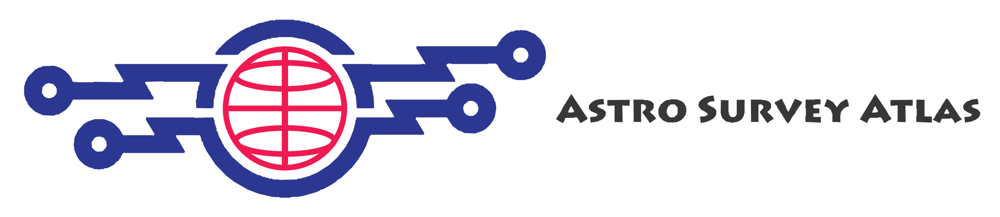

<p align="center">
  
</p>

# Astro-Survey-Atlas 🌌🔭

**English** | [简体中文](./README_ZH.md)

**Play With Your Own Astro Data.**

Astro-Survey-Atlas is a high-performance open-source stack designed for astronomical survey footprints, user-specific observations, and HEALPix/MOC spatial coverage. Our tools enable astronomers, researchers, and space enthusiasts to easily discover what public or private data exists on any given patch of sky and fetch only the precise files covering that region.

Contact: [aaron@72602.space](mailto:aaron@72602.space)

---

## 🎯 Core Problems We Solve

In modern observational astronomy, researchers are often overwhelmed by massive datasets from various sky surveys. We build tools that directly address the three fundamental questions of astronomical data workflows:

### 1. 🔍 What public data is on this patch of sky? (Public Data Discovery)
With countless observatories (SDSS, Gaia, JWST, Euclid, DESI, Pan-STARRS, CSST, etc.) releasing petabytes of sky imaging and catalogs, finding what exists for your target coordinates can be extremely tedious.
* **Our Solution:** We scan and index the footprints of major public sky surveys. By identifying overlapping sky regions using hierarchical spatial indexing (such as HEALPix/MOC), we make it easy to see where different surveys intersect and what multi-wavelength data is actually available.

### 2. 📂 What data do you already have? (User Data Integration & Management)
Astronomers often work with their own localized catalogs, raw FITS images, or proprietary observatory footprints, but lack a simple, modern way to overlay and visualize them together.
* **Our Solution:** We provide lightweight workspace and SDK tools to generate spatial footprints and local indexes for your own datasets, allowing you to seamlessly overlay and visualize your private observations alongside public sky surveys.

### 3. ⚡ How do you get only the specific files you need? (Targeted Retrieval & File Resolution)
Downloading whole terabyte- or petabyte-scale catalogs just to analyze a small patch of the sky is incredibly inefficient.
* **Our Solution:** Instead of bulk downloading entire datasets, we filter target sky areas down to overlapping HEALPix regions, and then trace those HEALPix indices back to the exact files (e.g., FITS files or catalog chunks) that cover them. This "footprint -> HEALPix -> target files" mapping allows users to download only the files essential to their research, significantly reducing download volume and complexity.

---

## 🚀 Key Ecosystem & Projects

Here is our active suite of production repositories designed to solve these three pillars:

| Project | Role & Solves Problem | Tech Stack | Status |
| :--- | :--- | :--- | :--- |
| [**Assets**](https://github.com/Astro-Survey-Atlas/Assets) | **1. Public Data Discovery**<br>Public survey directory, coverage maps, MOCs, and Resource Package v3. | TypeScript | 🗺️ Active |
| [**Workspace**](https://github.com/Astro-Survey-Atlas/Workspace) | **2. User Data Integration**<br>Your personal astronomical workspace — Aladin / MCP plane to overlay local, private, and public data. | TypeScript | 🏗️ Active |
| [**Warehouse**](https://github.com/Astro-Survey-Atlas/Warehouse) | **3. Targeted Retrieval**<br>Kubernetes operator that scans local, S3, and OSS astronomy files, extracts sky coverage, and publishes `CoverageLayer` indices. It does not proxy or reduce scientific payloads. | Helm / Kubernetes | ⚡ Active |
| [**MOC-Core-SDK**](https://github.com/Astro-Survey-Atlas/MOC-Core-SDK) | **2 & 3. Geometry Kernel**<br>Shared offline HEALPix/MOC kernel (`astro-survey-moc-core`): ICRS/NESTED cells, IVOA FITS MOCs, Resource Package v3. Used by Assets, Workspace, and Warehouse. | Python | 🔧 Active |

### 🔄 System Data Flow
```
Assets (Public Surveys Catalog) ──> Workspace (User Private Data & Overlay)
                                         │
                                         ▼
MOC-Core-SDK (Geometry Kernel) <── Warehouse (S3/OSS Storage File Scanner & Indexer)
```

---

## 🤝 Join Us & Contribute!

We believe that space belongs to everyone, and so does open-source science! Whether you are a professional astrophysicist, a software engineer, a web designer, or a curious amateur, there is a place for you here.

### How you can help:
1. **💻 Code & Design:** Contribute to our core repositories, optimize spatial query performance, or design beautiful astronomical maps.
2. **📝 Documentation:** Help us write guides, tutorials, or translate astronomy terms for a wider audience.
3. **🧪 Science & Data:** Suggest new survey footprints, catalogs, or use-cases for our tools.
4. **💬 Feedback & Ideas:** Open discussions, report bugs, or share your stargazing projects with us.

Issues belong on the repository they affect. This organization is Apache-2.0 on Assets, Warehouse, and MOC-Core-SDK.

---

## 💬 Connect With Us

Stay updated, ask questions, and share your ideas with our community!

* **GitHub Discussions:** Join the conversation on our [Discussions Board](https://github.com/orgs/Astro-Survey-Atlas/discussions)!
* **Issues & Requests:** Have a feature request or found a bug? Open an issue in the relevant repository.

---

> "Somewhere, something incredible is waiting to be known." — *Carl Sagan*
